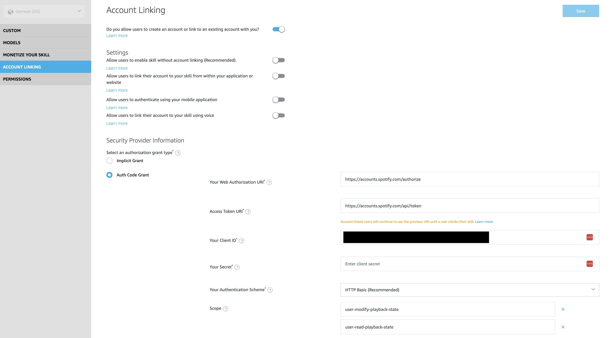
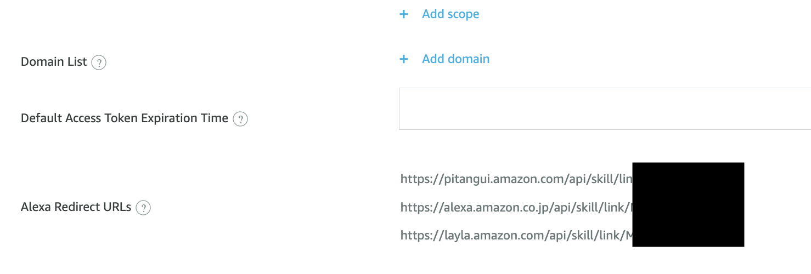
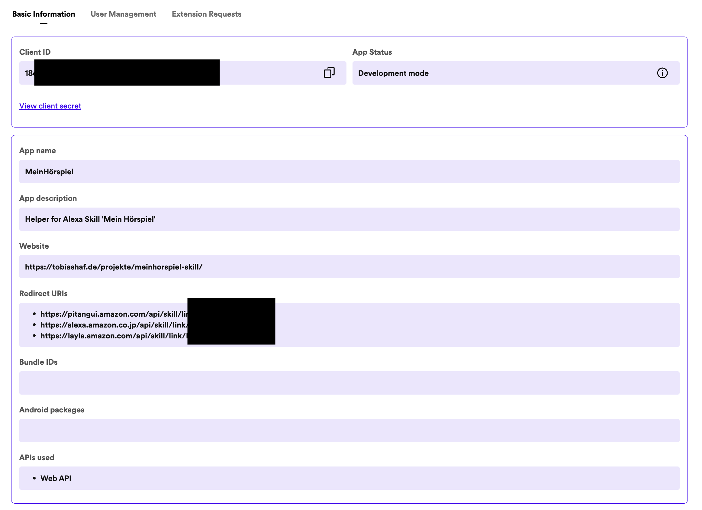
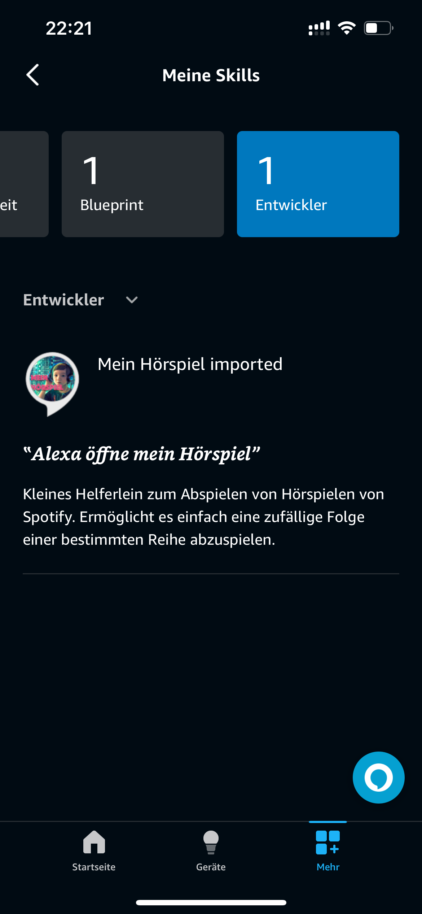

# mein-hoerspiel-skill
Alexa skill for playing a random album for a given artist from spotify.

## Usage

*Since the skill is based on the german language the invocation name and sub-commands are in german as well. If you want to translate the commands you have to adapt the interaction model in the Alexa developer console accordingly*

### Activate skill
> „Öffne mein Hörspiel“ (or your custom invocation name)

### Play random album
> Spiele (eine Folge) \<artist\>

### Activate skill and play album at once
> Öffne mein Hörspiel und spiele (eine Folge) \<artist\>

### Switch to another album (of same artist) during playback
> Spiele eine andere Folge

or

> Gefällt mir nicht

### Configure output device
If you have multiple Alexas configured you can choose which Alexa (or which Group) should be used for output.
> Konfiguriere Ausgabegerät

Alexa will now list all available devices and assign a number to each of them. It will then ask which number to use as default output device.

### Pause playback and store current position

>Pause

### Resume Playback (on stored position, if available)

>Fortfahren

## Installation

### Setup skill
1. Go to https://developer.amazon.com/alexa/console/ask and sign-in. 
2. Follow the instructions from https://developer.amazon.com/en-US/docs/alexa/hosted-skills/alexa-hosted-skills-git-import.html#import (use https://github.com/AceTheFace/mein-hoerspiel-skill.git as .git link in step 9)
3. If you receive a warning like "invalid invocation name" after import, go to "Invocation name" on the "build" tab and enter a proper invocation name, for example "mein hörspiel". Check [alexa documentation](https://developer.amazon.com/de-DE/docs/alexa/interaction-model-design/design-the-invocation-name-for-your-skill.html) to see what a proper invocation name looks like. I use "mein hörspiel".
4. In order to enable the skill to access a users spotify account you have to enable "account linking" for the skill:
 

 Use the following entries:
 - Your Web Authorization URI: https://accounts.spotify.com/authorize
 - Access Token URI: https://accounts.spotify.com/api/token
 - Your Client ID: *will be added in a later step*
 - Your Secret: *will be added in a later step*
 - Your Authentication Scheme: HTTP Basic (Recommended)
 - Add two scopes:
    - user-read-playback-state
    - user-modify-playback-state
5. Keep the tab open since we need the displayed "Alexa redirect URLs" later

    

### Setup spotify app
1. Go to https://developer.spotify.com/dashboard
2. Click "create app"
3. Use the following entries:
- App name: Mein Hörspiel (or whatever you like)
- App description: App for 'Mein Hörspiel' Alexa skill (example)
- Redirect URI: Insert the first (!) Alexa redirect URLs from above
- Which API/SDKs are you planning to use: Web API
4. Click "save"
5. Click "Settings" again to edit the app configuration again
6. Add the remaining two Alexa redirect URIs.
7. Save configuration

Reopen "settings". It should now look like this:

Click "view client secret" and keep this tab open. Switch back to the Alexa Console Tab

### Finish account linking

Copy Spotify Client ID and Client Secret to the account linking fields "Your client ID" and "Your secret" and hit save.

### Deploy skill

In Alexa Developer Console switch to the "code" tab and hit "deploy". This will make the skill available to your Alexa account. Others cannot use it!

## Enable skill in Alexa

1. Open the alexa app on your phone go to "more+" and "Skills and Games".
2. Scroll down to the button "my skills"
3. Scroll to the right until you see "Developer", it should display at least "1" skill. Once you select it you should see your "mein hörspiel" skill:

4. Click on the skill and in next screen choose "to use skill, activate it".
5. If account linking has been setup properly a spotify login dialog should show up. Once entered your spotify credentials the skill should be activated properly and you're ready to use it on your Alexa devices by using your invocation name. 

# Happy? Feel free to donate!

*Thank you!*